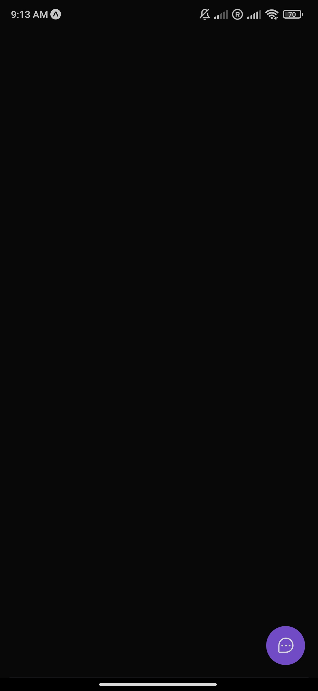
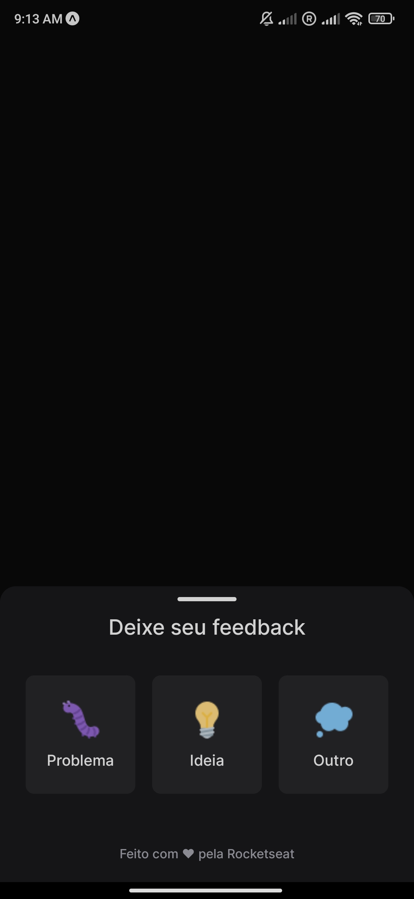
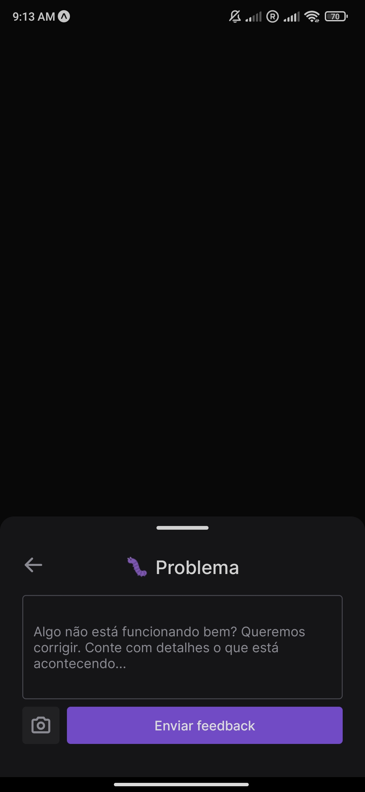
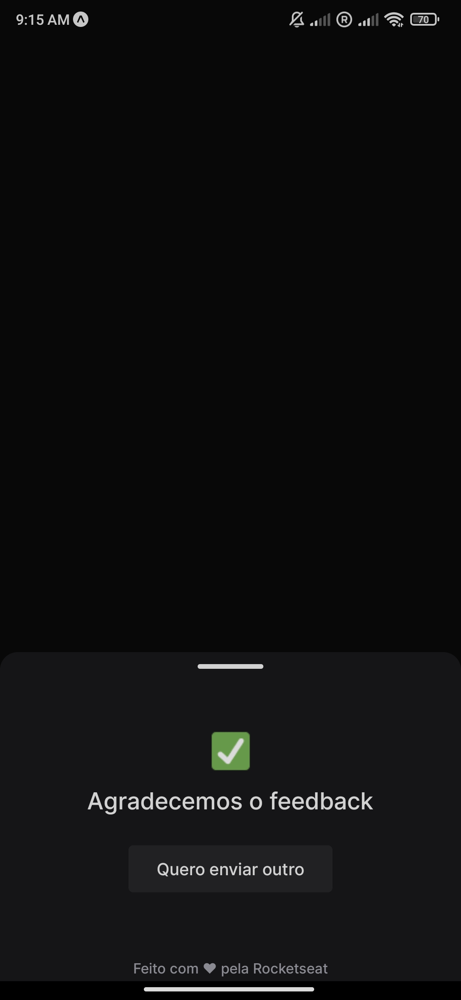

#NLW Return Impulse
#### _Mobile Application_

This is a project developed during the NLW Return Impulse of [Rocketseat](rocketseat.com.br).
Basically it's a widget to report user feedback through a dynamic form that selects Type, Comment and Screenshot and submits it to the backend.

Requirements
- Node.js
- NPM
- Expo
- React Native
- ✨You can also use Docker to setup the environment✨


## Installation

```sh
-git clone https://github.com/adelino-masioli/nlw-impulse-mobile
-cd nlw-impulse-mobile
-npm i
-npm install --global expo-cli
-change api url on: src/libs/api.ts
-expo start
```

### Screenshot






### Developer
Adelino Masioli adelinomasioli@gmail.com Copyright (c) 2022